# ROS—XiaoQiang机器人使用教程
## 一.使用前的准备
### 1.设置网络
首先将小强的主机连接上电脑显示器使用 HDMI 到 VGA 转接头进行连接, 小强的默认密码是 **xiaoqiang** 进入系统连接路由器。
```
WIFI名称为：
TP-LINK_xiaoqiang
密码为：
xiaoqiang
已分配给小强机器人的静态IP为：
192.168.1.101
```
###**注意**
若重新设置路由器请参照`小强ROS机器人用户手册——综合版`进行设置，设置内容包括：
1. 为ROS机器人分配静态IP，方便以后连接
2. **将路由器的无线设置中的信道设为1-11之间，否则小强机器人搜索不到路由器信号。（重要）** [*参考链接*](https://askubuntu.com/questions/645287/cant-find-specific-wifi-network-ubuntu-14-04?noredirect=1&lq=1)
### 2. 本地遥控端设置
1. 配置本地Ubuntu 14.04系统  
2. 安装SSH SCREEN  
```
sudo apt-get install ssh screen
```
3. 安装 ROS JADE 版本
4. 添加远程目录  
因为后续需要经常操作更改小强主机上的文件,现在我们将小强主机远程目录添加到本地遥控端,这样在本地就可以直接图形化操作小强主机上的文件(小强主机相当于本地Ubuntu 系统的外挂硬盘)  
点击下图位置,添加小强远程目录

输入小强远程目录,请将 ip 换成上文提到的实际 ip 地址 `192.168.1.101`

根据提示输入小强主机用户名和密码  
一切正常的话,已经打开了小强主机的 home 目录,为了未来使用方便,可以将这个地址添加到 bookmark

下次直接点击这个 bookmark,就能访问小强主机的 home 目录


5. 配置完成,开始使用   

(1)在本地遥控端打开一个命令终端   
(2)通过 ssh 连接小强,请将 xxx 换成实际的 ip
```
ssh xiaoqiang@xxx.xxx.xxx.xxx
即：
ssh xiaoqiang@192.168.1.101
或：
ssh -X xiaoqiang@192.168.1.101 (该命令可在本地遥控端使用图形界面)
```
(3)启动遥控程序
```
rosrun nav_test control.py
```
(4)可以开始通过方向键来控制小强的移动了。空格键是停止。 Ctrl + C 退出程序。
## 二.教程——蓝鲸智能开源软件仓库的使用和 ROS 开机启动任务的配置
小强的所有软件源码都共享在蓝鲸智能的开源仓库里,任何人任何组织都可以自由下载使用或进行二次开发,  [**软件仓库地址**](https://github.com/BlueWhaleRobot)  
开源仓库中的软件可以直接 git clone 到小强的 ROS 工作目录里,然后就可以直接用 ROS 的工具链 catkin_make 编译使用。  
小强的 ROS 工作目录为:/home/xiaoqiang/Documents/ros/src
1. STARTUP 软件包功能介绍  
小强主机开机后,会自动启动名字为 startup 的 linux 服务脚本,startup 服务脚本运行时会去启动 startup 软件包中的startup.launch 文件 在 ubuntu 系统中注册的复制品。因此我们通过修改startup 软件包中的 startup.launch 文件,然后将这个文件在 ubuntu 系统中注册为 startup 服务,就能控制小强主机的开机启动任务了。
2. 在小强主机中下载安装 STARTUP 软件包  
a.在本地遥控端 ssh 连接小强主机,参考上篇教程的配置
```
ssh xiaoqiang@192.168.1.101
```
b.进入小强 ROS 工作目录,查看是否有 startup 文件夹
cd Documents /ros/src/
ls
如果存在,说明已安装好 startup 软件包,可以直接进行下面的操作三
如果想和开源仓库同步更新这个 startup 软件包,请输入如下命令
```
cd startup
git stash
git pull
cd ..
```
3. 修改软件包中 LAUNCH 文件夹内的 STARTUP.LAUNCH 文件  
利用上篇教程安装的 atom 编辑器,在本地遥控端直接编辑这个文件(需要远程
访问小强的主机文件目录,请参考上篇基础操作教程进行配置)
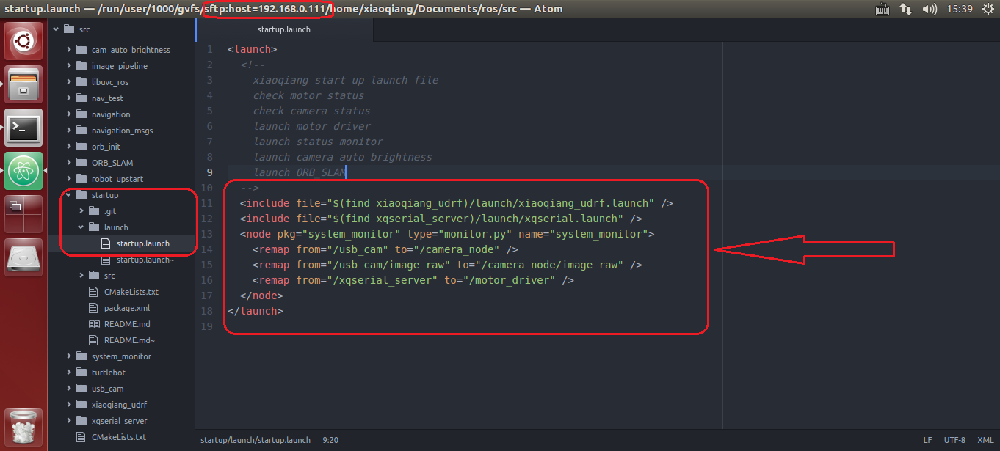
在上图箭头区域,添加或删除你需要启动的 ROS launch 文件及 ROS node,这些项目在下文将被添加进小强主机的开机启动项里,小强下次开机会自动运行这些项目。最后保存退出
4. 将 STARTUP.LAUNCH 文件在小强主机中注册为 STARTUP 开机启动服务  
接着二中的 ssh 窗口输入  
a.首先将之前注册的 startup 服务停止和删除
```
sudo service startup
rosrun robot_upstart stop uninstall startup
```
b.重新注册 startup 开机启动服务
```
rosrun robot_upstart install startup/launch/startup.launch
```
5. 远程重启小强主机,查看开机启动项是否正常加载  
接着上文的 ssh 窗口输入  
a.下发重启命令
```
sudo shutdown -r now
```
b.重新 ssh 连接
```
ssh xiaoqiang@192.168.1.101
```
c.查看 startup 服务状态
```
sudo service startup status
```
正常的话会显示 startup start/running 如下图所示

d.还可以进一步查看相关的 topic 是否已经发布出来
```
rostopic list
```
## 三.在 rviz 中显示小强机器人模型
将小强主机接入显示器和键盘,开机后,打开终端,先关闭开机任务
```
sudo service startup stop
roscore
```
在小强主机上新开一个终端,启动这个软件包
```
roslaunch xiaoqiang_udrf display.launch
```
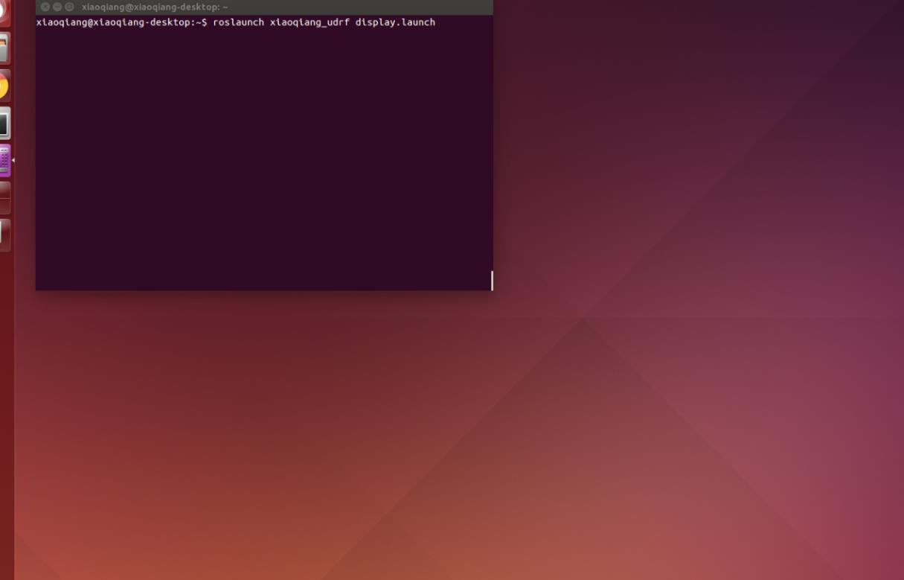
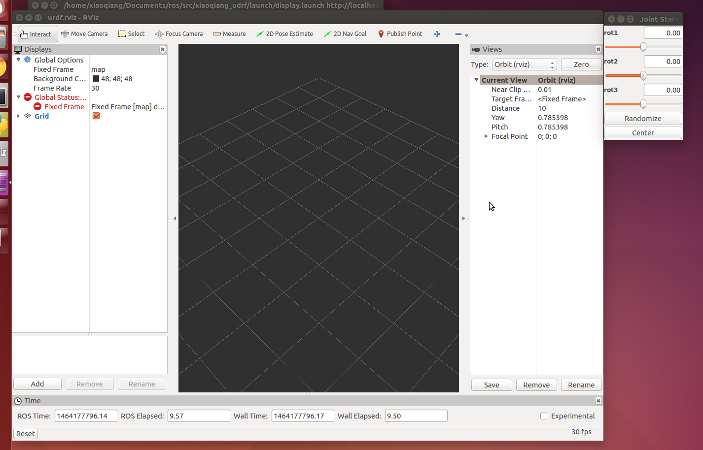
此时发现没有任何显示,需要添加 rviz 显示项目


还是有问题,整个模型透明发白,这是因为 rivz 中的全局坐标系“fixed frame”设置的不合适,将 map 改成 base_link 后即可正常显示

现在操作右上角的滑动条就可以使相应的轮子转动。
修改 xiaoqiang_udrf 文件夹内的 display.launch 文件 ,false 改 true
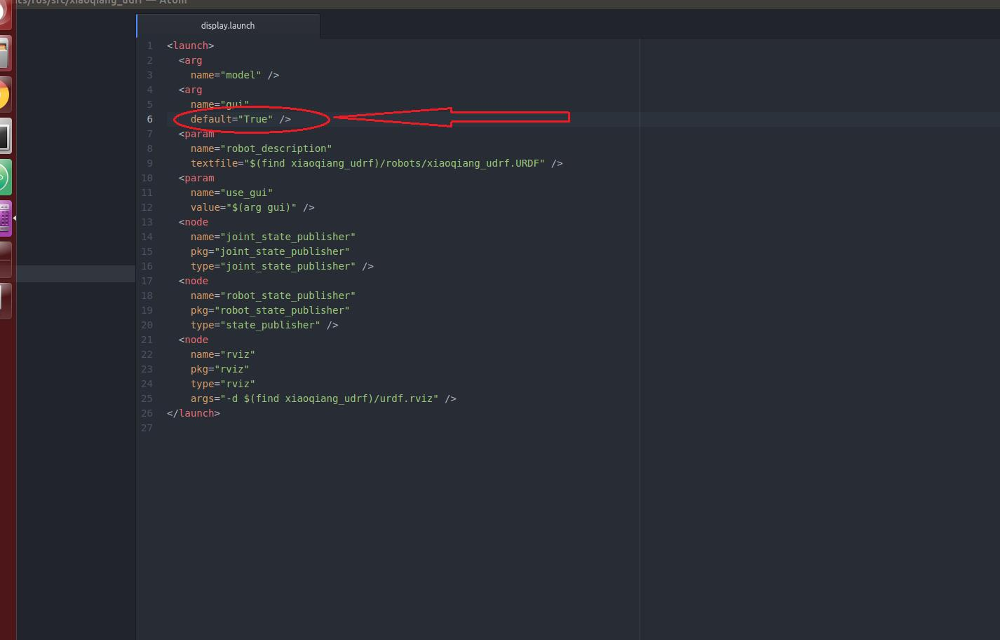

## 四.惯性导航自主移动测试
接下来开始测试小强的惯性导航功能。这里的惯性导航,是指利用小强自身佩戴的惯性传感器(加速度和陀螺仪)和底盘编码器信息进行定位和移动。需要的 ROS 软件包有:1.底层驱动 xqserial_server, 2.机器人模型包 xiaoqiang_udrf, 3.惯性导航测试软件包 nav_test.
1. ssh 方式在小强主机上完成的操作  
请确保小强已经正常启动,小强主机正常启动完成后会自动运行上面提到的三个软件包,不需要手工启动相应的 luanch 文件。  
a. 新开一个终端,启动导航基础程序  **(ssh登录小强命令终端)**
```
ssh -X xiaoqiang@192.168.xxx.xxx
roslaunch nav_test fake_move_base_blank_map.launch
```
b. 新开一个终端,检查是否所有 tf 都已经就位 **(ssh登录小强命令终端)**
```
ssh -X xiaoqiang@192.168.xxx.xxx
rosrun tf view_frames evince frames.pdf
```
正常会显示下图

2. 在本地遥控端上完成的操作  
本地遥控端必须是安装好 ROS jade 版本的 ubuntu 系统,同时保证和小强主机在同一个局域网内。因为需要在本地窗口用 rviz 显示
小强姿态和路径轨迹(ssh 中不能直接打开 rviz),  所以需要使用 ros 的分布式网络配置方案。  
同时在本地遥控端也需要安装好机器人模型包 xiaoqiang_udrf。  
概括来说:本地遥控端打开自己的 rviz,接收显示小强主机上的 topic,而小强模型数据则直接从本地获取。  
具体过程如下:

a.在本地开一个命令行终端,在本地的 hosts 文件内添加小强的 ip **(本地的命令终端)**
```
sudo gedit /etc/hosts
添加
xxx.xxx.xxx.xxx xiaoqiang-desktop #请将 xx 改成小强的实际 ip 地址
即
192.168.1.101 xiaoqiang-desktop
```
b.新开一个命令终端输入 **(本地的命令终端)**
```
export ROS_MASTER_URI=http://xiaoqiang-desktop:11311
```
继续执行
```
rostopic list
```
如果可以看到小强的 topic 了,就说明配置成功。  
c. 安装模型软件包,更新本地 ROS包环境变量,因为需要从本地读取模型数据 **（本地的命令终端）**
```
mkdir ~/Documents/ros/src
cd ~/Documents/ros/src
catkin_init_workspace
git clone https://github.com/BlueWhaleRobot/xiaoqiang_udrf.git
#切换到 master 分支
cd xiaoqiang_udrf
git checkout master
#编译完成安装
cd ..
cd ..
catkin_make
```
d.打开 rviz 图形界面  **(本地的命令终端)**
```
source ~/Documents/ros/devel/setup.sh
export ROS_MASTER_URI=http://xiaoqiang-desktop:11311
rviz
```
当窗口打开后,点击左上角的 file->open,选择小强里的  
``/home/xiaoqiang/Documents/ros/src/nav_test/config/nav.rviz 文件。``  
这时界面应该如下图显示,关于如何访问小强主机上的文件,请参考之前的教程。
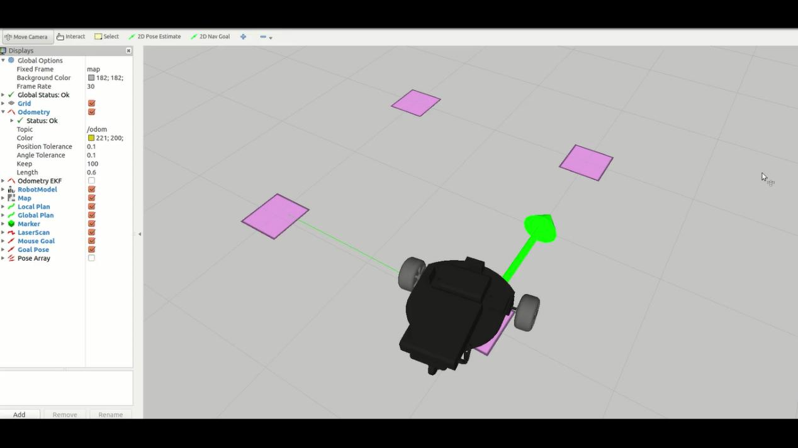
3. 在小强主机远程 ssh 窗口内完成最后操作  **(ssh登录小强命令终端)**
```
rosrun nav_test square.py
```
演示结果如下图所示  


## 五.kinect1 代 ROS 驱动测试与安装
1. LIBFREENECT 测试
将小强主机接入显示器和键盘,在小强主机上新开一个命令终端输入
```
freenect-glview
```
可以看到如下图的类似界面
  
2. ROS 驱动测试  
关闭步骤 1 中的程序,新开一个命令窗口,使用 freenect_launch 启动相关 kinect 节点  
```
roslaunch freenect_launch
freenect-xyz.launch
```
新开 1 个窗口打开 rviz
```
rviz
```
选择需要显示的内容,例如 kinect 的 rgb 图像和深度点云,显示效果如下


kienct 各项功能的开启在  
`/home/xiaoqiang/Documents/ros/src/freenect_stack/freenect_launch/launch/examples/freenect -xyz.launch` 里
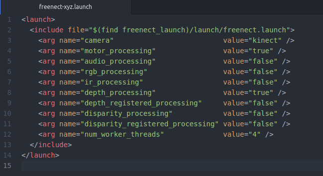

通过设置 true 或者 false 来开启、关闭相应功能

## 六.使用 rostopic 控制 kinect 的俯仰角度

**准备工作 :**  

请查看 kinect 版本,在 kinect 底座标签上有注明，型号为 model1414   

**操作步骤 :**

1. 在本地虚拟机新开一个窗口,启动 freenect_stack 驱动。  
ssh 登入小车主机  
```
ssh -X xiaoqiang@192.168.1.101
roslaunch freenect_launch freenect-xyz.launch
```
正常启动会出现下图,如果出现红色错误(驱动缺陷),请 ctrl+c 关闭命令后等待 6 秒(真的
需要 6 秒),再次尝试允许上面的 roslaunch 命令。


2. 在本地虚拟机新开一个窗口,发布电机角度控制命令  
ssh 登入小车主机
```
ssh -X xiaoqiang@192.168.1.101
rostopic pub /set_tilt_degree std_msgs/Int16 '{data: -20}' -r 1
```
如果一切正常,现在可以看到 kinect 的仰角不断变小,上述命令中的{data: -20}数字就代表角
度,可以设置为 30 到-30 之间的整数

## 七.使用 kinect 进行自主移动避障
**原理 :**  
freenct_stack 包提供 kinect 驱动,其发布的点云通过 image_pipeline 转换成障碍物栅格分布图。
nav_test 软件包启动底盘导航程序后会自动处理分析障碍物分布图,之后根据 rivz 发布的目标
导航点自主移动。

**操作步骤 :**  
1. 配置小车主机和本地虚拟机的 hosts 文件,使两者能互相访问对应的 ros 数据  

A. 配置本地虚拟机  
```
sudo gedit /etc/hosts
```
将下图中的 ip 地址换成小车实际数值


B. 配置小车主机
局域网 ssh 登入小车主机
```
ssh -X xiaoqiang@192.168.1.101
sudo gedit /etc/hosts
```
将下图中的 ip 地址换成本地虚拟机实际数值,主机名称改为虚拟机名称


2. 在本地虚拟机中新开 3 个窗口,分别 ssh 登入小车,启动原理部分提及的相关软件包

A. SSH 登入 **(三个窗口均为SSH登录小强的命令终端)**
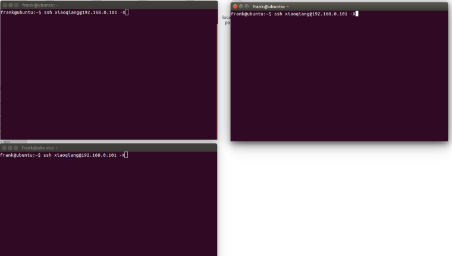
```
命令均为；
ssh -X xiaoqiang@192.168.1.101 (与截图中的不一致)
```
B. 在第一个窗口启动 KINECT 驱动
```
roslaunch freenect_launch kinect-xyz.launch
```
C. 在第二个窗口设置 KINECT 俯仰角, **这个角度不是任意的**
```
rostopic pub /set_tilt_degree std_msgs/Int16 '{data: -19}' -r 1
```
D. 编辑底盘导航程序配置文件  
`/HOME/XIAOQIANG/DOCUMENTS/ROS/SRC/NAV_TEST/CONFIG/FAKE/BASE_LOCAL_PLANNER_P
ARAMS2.YAML` ,使能 KINECT


E. 在第三个窗口启动底盘导航程序
```
roslaunch nav_test fake_move_base_blank_map.launch
```
F. 全部正常,会出现类似下图的界面,到此小车端配置启动完成


3. 在本地虚拟机中新开 1 个窗口,用来启动 rviz  

A 加入 ROS 局域网后,打开 RVIZ **(本地的命令终端)**
```
export ROS_MASTER_URI=http://xiaoqiang-desktop:11311
rviz
```


B. 点击 RVIZ 界面左上角的 OPEN CONFIG ,选择小车主机上的
`/HOME/XIAOQIANG/DOCUMENTS/ROS/SRC/NAV_TEST/CONFIG/NAV_ADDWA_KINECT.RVIZ` 配置
文件


C. 正常的话,现在 RVIZ 中将出现类似下图的画面,现在所有配置都已经完成,开始发布导航目标点


D. 发布一个目标点,小车会开始自主移动


E. 小车到达目标点,请继续尝试其它位置


## 八. rplidar 二代激光雷达的使用暨利用 udev 给小车增加串口设备

小车主机和底盘的通信是通过串口实现的,在实际开发过程中我们可能会给小车增加串口外设,这会导致串口号(TTYUSB)的混乱,引发小车底盘 ROS 驱动和串口设备的异常。下文将以 RPLIDAR 二代激光雷达为例,演示通过修改 UDEV 文件指定设备串口号的方式解决串口
冲突问题。 [***方法依据***](http://wirespeed.xs4all.nl/mediawiki/index.php/Udev_rules_file_for_Arduino_boards)

1. 查看各个串口设备的 ID
```
sudo apt-get install expect-dev
unbuffer udevadm monitor --environment | grep 'ID_SERIAL='
```
将底盘通信u转串重新插拔一下,终端会打印出此设备的ID信息,例如下
图:  
`Prolific_Technology_Inc._USB-Serial_Controller"`  
再将激光雷达的 usb 适配器重新插入主机,终端也会打印出激光雷达的ID信息,例如下图:
`"Silicon_Labs_CP2102_USB_to_UART_Bridge_Controller_0001"`
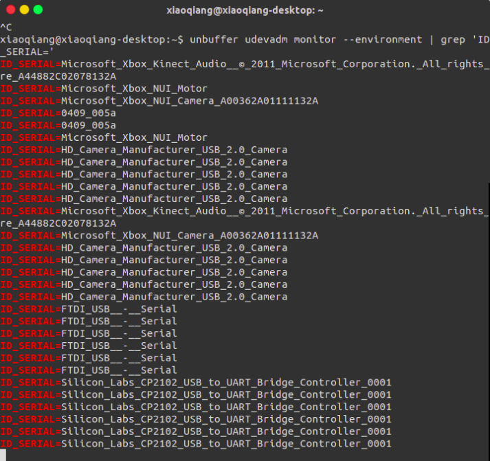

2.根据获取的串口设备的 ID,建立 UDEV 规则文件,将底盘通信U转串指定为TTYUSB001,将激光雷达指定为 TTYUSB002
```
sudo gedit /etc/udev/rules.d/ 60 -persistent-serial.rules
```
输入下面内容后保存,请将文中 ID_SERIAL 后面的字符串换成步骤1中获取的 ID
将`60-persistent-serial.rules`中的内容修改成如下所示 [***udev方法出处***](http://wirespeed.xs4all.nl/mediawiki/index.php/Udev_rules_file_for_Arduino_boards)
```
ACTION!= "add" ,
GOTO = "persistent_serial_end"
SUBSYSTEM!= "tty" ,
GOTO = "persistent_serial_end"
KERNEL!= "ttyUSB[0-9]*" ,
GOTO = "persistent_serial_end"
# This is old 11.10 style: IMPORT="usb_id --export %p"
IMPORT{builtin}= "path_id"
ENV{ID_SERIAL}== "Prolific_Technology_Inc._USB-Serial_Controller", SYMLINK= "stm32Car", SYMLINK+="ttyUSB001" , OWNER= "xiaoqiang"
ENV{ID_SERIAL}== "Silicon_Labs_CP2102_USB_to_UART_Bridge_Controller_0001" , SYMLINK= "rplidarA2", SYMLINK+= "ttyUSB002" , OWNER= "xiaoqiang"
LABEL= "persistent_serial_end"
```
更新系统 udev 规则
```
sudo udevadm control –reload
```
重新插拔所有 usb 串口设备,现在底盘通信u转串成功被识别为 ttyUSB001、激光雷达被识别
为 ttyUSB002,与设备插入顺序和端口无关。
```
ls /dev
```
可查看设备号，如下图所示：  


3. 修改小车底盘 ROS 驱动节点 LAUNCH 文件,将通信设备指定为上文设置的TTYUSB001路径`Documents/ros/src/xqserial_server/`
4. 修改 RPLIDAR 二代激光的 ROS 驱动节点 LAUNCH 文件,将通信设备指定为上文设置的 TTYUSB002  


*激光雷达驱动的安装*  
```
cd ~/Documents/ros/src
git clone https://github.com/BlueWhaleRobot/rplidar_ros.git
cd ..
catkin_make
```
5. 重启小车,现在已经可以同时正常使用激光雷达和小车底盘,例如运行下述命令测试激光雷达
```
roslaunch rplidar_ros view_rplidar.launch
```
**  
第二种方式,使用键盘遥控
```
ssh xiaoqiang@192.168.1.101
rosrun nav_test control.py
```
第三种方式,使用安卓手机 app, **参考小强用户手册教程(5)**  
被建图环境与生成的地图如下图所示
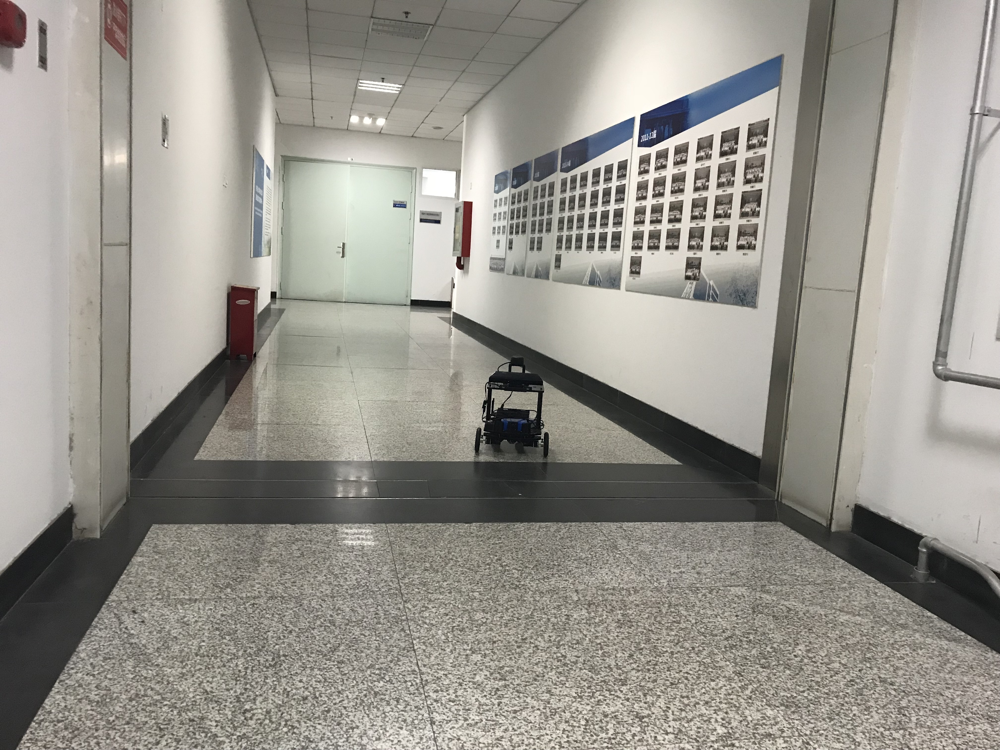
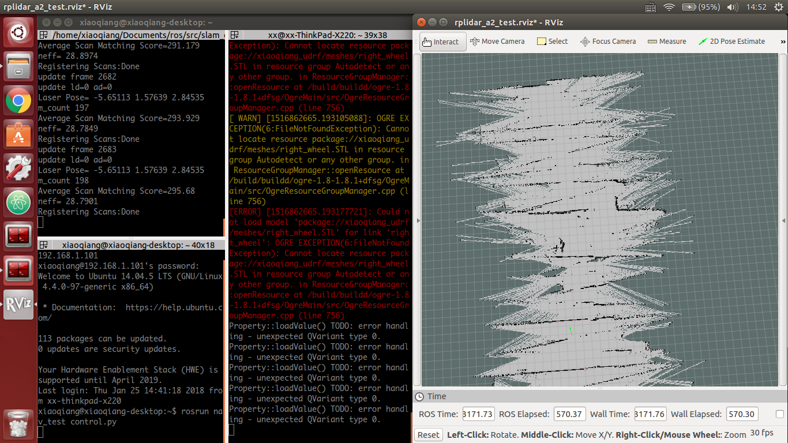
4. 保存地图
ssh 登录小强,在小强 home 目录下保存为 work0 开头的文件
```
ssh xiaoqiang@192.168.1.101
rosrun map_server map_saver -f work0
```
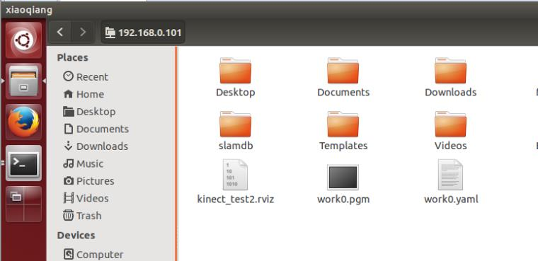

## 十. AMCL 导航测试
下文将演示 AMCL 导航操作,使用 rplidar a2 作为 scan 输入, 教程 九 中建立的地图文件作为全局 map  
一. 准备工作  
先安装升级 nav_test、laser_filters 软件包  
1. SSH 登入小强主机,进入小强 ROS 工作空间
```
ssh xiaoqiang@192.168.1.101
cd Documents/ros/src/
```
2. 更新升级软件包
```
rm -rf
laser_filters
git clone https://github.com/BlueWhaleRobot/laser_filters.git
cd nav_ test
git stash
git pull
cd ..
cd ..
catkin_make
```
3. 更新小强 HOSTS 文件和本地虚拟机的 HOSTS 文件,使小强和本地虚拟机可以相互通信,参考教程 八 中的 1.A 和 1.B 部分  

二. 启动导航节点
```
roslaunch nav_test xiaoqiang_a2_demo_amcl.launch
```
正常会出现下图的类似结果,同时雷达开始旋转
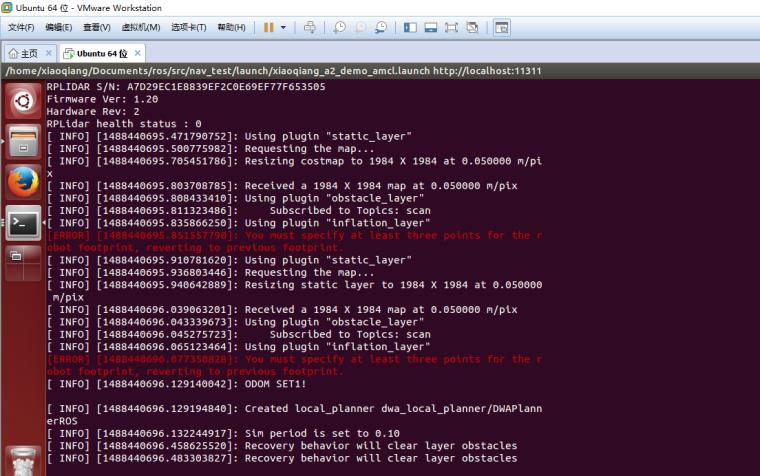

三. 打开操作客户端  
1. 在本地虚拟中启动 RVIZ,选择打开小强 ROS 工作目录下的  
`NAV_TEST/CONFIG/XIAOQIANG_AMCL.RVIZ` 配置文件
```
export ROS_MASTER_URI=http: //xiaoqiang-desktop:11311
rviz
```
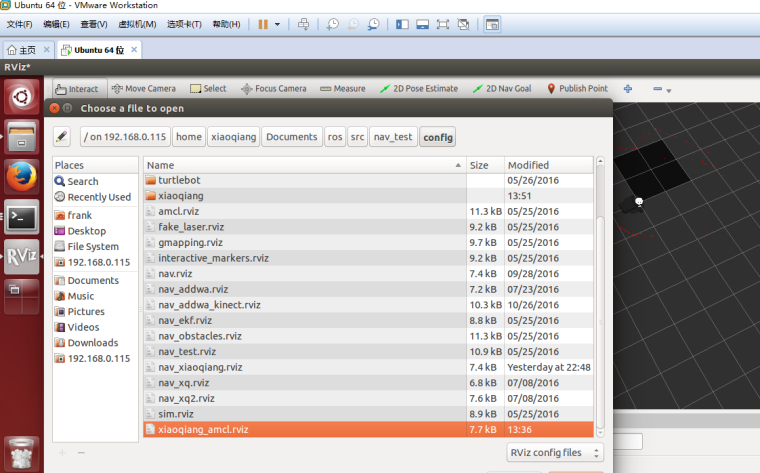

2. 等待几秒后,RVIZ 正常会出现类似下图的界面
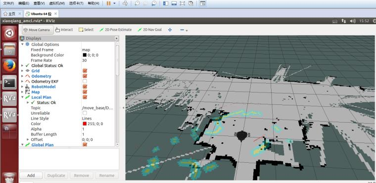

四. 开始导航测试
1. 在 RVIZ 中使用 2D POSE ESTIMATION 设置机器人的初始 POSE 在 MAP 中的位置因为 AMCL 算法需要一个较为精确的初始值,才能进一步由当前雷达扫描点阵匹配出机器人在 MAP 中的真实位置。
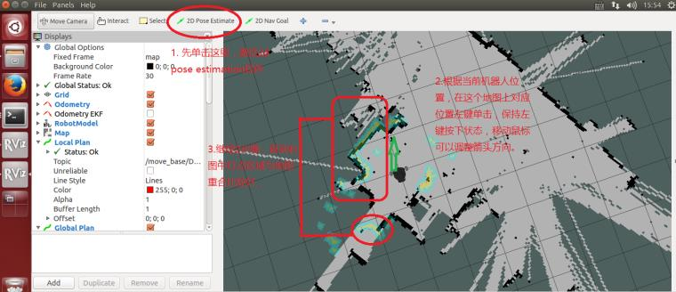

2. 在 RVIZ 中使用 2D NAV GOAL 给小强发布目标点


3. 小强开始自主移动到指定位置
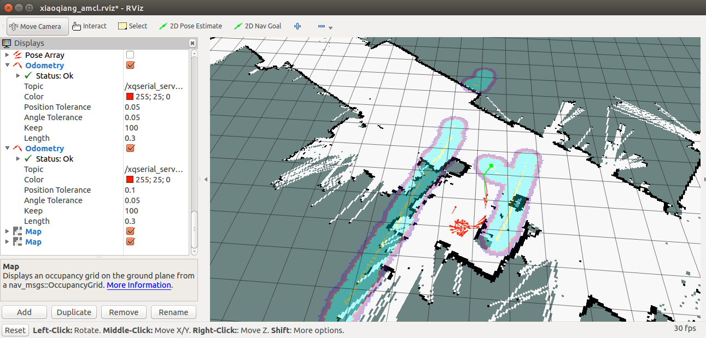

## 十一. 大范围激光雷达 slam 与实时回路闭合测试
借助谷歌的 CARTOGRAPHER 配合 SLAMTEC 的激光雷达,我们可以尝试对大型建筑建立平面图。  
**本教程操作思路 : 原教程考虑到 WIFI 网络覆盖是一个问题,所以借助蓝牙手柄来遥控小车运动。因为我在做这个教程的时候没有蓝牙手柄，因此我采用的是使用 SSH 通过 WiFi 遥控小车运动，期间通过 ROSBAG 录制激光雷达数据,最后重放BAG 建图。**  
注:以下所有操作在小车主机 UBUNTU 上完成  
### 操作步骤:
1. 新开一个窗口启动 rplidar
```
roslaunch rplidar_ros rplidar.launch
```
2. 新开两个窗口启动 ps3 手柄遥控程序,按手柄连接键连上小车 **(如果你有蓝牙手柄的话)**  
第一个窗口  
```
sudo bash
rosrun ps3joy ps3joyfake_node.py
```
第二个窗口
```
roslaunch turtlebot_teleop ps3fakexiaoqiang_teleop.launch
```
3. 新开一个窗口启动 rosbag 录制进程,开始录制激光雷达数据/scan
```
rosbag record /scan
```
4. 用手柄遥控小车运动,绕建图区域一圈,也可以多圈
5. bag 录制完成,关闭上文的1、2、3窗口  
新录制的点bag文件在小强 home 目录下,将其重命名为1.bag
6. 启动 cartographer_ros 开始 bag 回放建图
```
roslaunch cartographer_ros demo_xiaoqiang_rplidar_2d.launch bag_filename:=/home/xiaoqiang/1.bag
```
7. 一切正常的话,现在可以看到下图的类似效果,等待 bag 包 play 完


8. 保存地图
```
rosservice call /finish_trajectory "stem: 'rplidar_test'"
```
## 十二. 利用 ORB_SLAM2 建立环境三维模型
想要实现视觉导航,空间的三维模型是必须的。ORB_SLAM 就是一个非常有效的建立空间模型的算法。这个算法基于 ORB 特征点的识别，具有准确度高,运行效率高的特点。我们在原有算法的基础上进行了修改,增加了地图的保存和载入功能,使其更加适用于实际的应用场景。下面就介绍一下具体的使用方法。  
**准备工作**  
在启动 ORB_SLAM2 之前,请先确认小强的摄像头工作正常。  
ORB_SLAM2 建图过程中需要移动小车,移动小车过程中 ORB_SLAM2 的运行状态不方便显示(ssh 方式比较卡顿,也不可能拖着显示器),因此请先安装好 **[小强图传遥控 windows 客户端]**(见小强ROS机器人用户手册)。  
1. 启动 ORB_SLAM2
更改配置文件  
ORB_SLAM2 的配置文件位于  
`/home/xiaoqiang/Documents/ros/workspace/src/ORB_SLAM2/Examples/ROS/orb_slam2/Data`   
文件夹内。更改 setting.yaml 其中的 LoadMap 的值,将其设置为 0。当设置为 1 的时候程序会在启动后自动从/home/xiaoqiang/slamdb 文件夹内载入地图数据。当设置成 0 时,就不会载入地图数据。由于我们是要创建地图,所以LoadMap 要设置为 0。
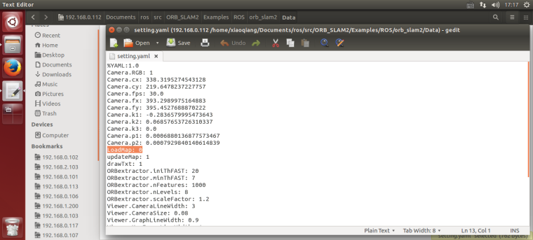

ssh 方式进入小强,执行以下指令
```
ssh -X xiaoqiang@192.168.1.101
roslaunch orb_slam2 start.launch
```
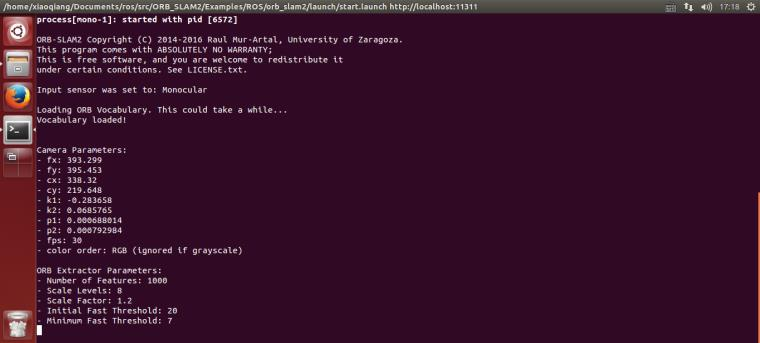

2. 开始建立环境三维模型
打开小强图传遥控 windows 客户端,点击“未连接“按钮连接小强。在图传窗口右键打开”原始图像“和”ORB_SLAM2 的特征点图像“


上图中,左侧图像是摄像头原始彩色图像,右侧是 ORB_SLAM2 处理后的黑白图像。当前 ORB_SLAM2 还没有初始化成功,所以黑白图像没有特征点。按住”w”键开始遥控小强往前缓慢移动,使 ORB_SLAM2 初始化成功,即黑白图像开始出现红绿色特征点现在就可以开始遥控小强对周围环境建图,遥控过程中需要保证黑白图像一直存在红绿色特征点,不存在则说明视觉 lost 了,需要遥控小强退回到上次没 lost
的地方找回视觉位置。
3. 使用 rviz 查看建图效果  
在本地虚拟机 hosts 中添加小强 ip 地址,然后新开一个终端打开 rviz  
```
export ROS_MASTER_URI=http: //xiaoqiang-desktop:11311
rviz
```
打开`/home/xiaoqiang/Documents/ros/src/ORB_SLAM/Data/rivz.rviz` 配置文件
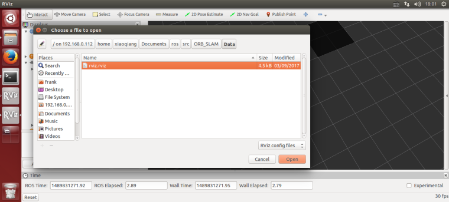

如下图所示,红黑色点是建立的三维模型(稀疏特征点云),蓝色方框是 keyframe可以表示小强轨迹
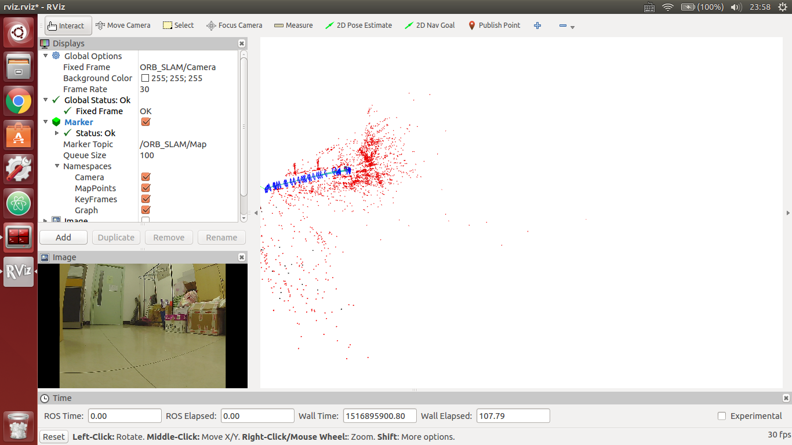

4. 保存地图
当地图建立的范围满足自己要求后,在虚拟机新开一个命令窗口,输入下列命令保存地图
```
ssh -X xiaoqiang@192.168.1.101
rostopic pub /map_save std_msgs/Bool '{data: true}' -r 0.1
```
这个命令每隔 10s 触发 1 次保存任务,因此当看到下图时,请关闭上面的窗口  
在虚拟机新开一个命令窗口,输入下列命令侦测地图保存命令有没有发出
```
ssh -X xiaoqiang@192.168.1.101
rostopic echo /map_save
```
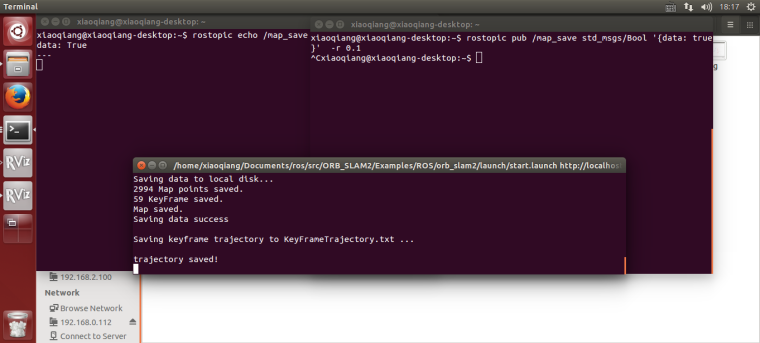  

地图文件会被保存进用户主目录的 slamdb 文件夹内。

## 十三. 利用 DSO_SLAM 建立环境三维模型
Direct Sparse Odometry(DSO)是业内很流行的 lsd_slam 系统作者的学生 Jakob Engel 开发的,实
测性能和精度优于 lsd_slam。 DSO 上个月被作者开源到 github,同时还一并开源了 DSO 在 ros系统下的使用代码实例 dso_ros.  
本篇教程将演示如何在小强开发平台上安装 DSO 和 dso_ros, 利用小强平台上的摄像头实
时运行 DSO 进行三维建模, 先上教程的最后测试视频(效果很不错)。


1. DSO 的安装  
注:因为小强开发平台已经提前安装好了不少 DSO 需要的依赖包,下文将跳过这些包的安装,请其它开发平台的读者参考 github 上的完整安装教程进行安装。
***另 : 以下的安装和配置过程我已在该ROS机器人上配置过了，请直接跳到步骤3开始使用DSO_SLAM***  

A. 安装依赖包
```
sudo apt-get install libsuitesparse-dev libeigen3-dev libboost-dev
sudo apt- get install libopencv-dev
```
B. 下载源代码
```
cd ~/Documents/
git clone https: //github.com/JakobEngel/dso.git
```
C. 继续配置依赖包
```
sudo apt-get install zlib1g-dev
cd ~/Documents/dso/thirdparty
tar -zxvf libzip -1.1.1 .tar.gz
cd libzip -1.1.1 /
./configure
make
sudo make install
sudo cp lib/zipconf.h /usr/ local / include /zipconf.h
```
D. 编译安装
```
cd ~/Documents/dso/
mkdir build
cd build
cmake ..
make -j
```
2. dso_ros 的安装

注:原作者提供的源代码有两个分支,master 分支对应 rosbuild 版,catkin 分支对应 catkin
版。对于现代 ROS 版本,推荐使用 catkin 版本,安装使用更方便。但是作者的 catkin 分支存
在代码缺陷,实际无法安装使用,因此下文将安装我们蓝鲸智能修改之后的 dso_ros 版本。
```
cd ~/Documents/ros/src
git clone https://github.com/BlueWhaleRobot/dso_ros.git
cd ..
export DSO_PATH=/home/xiaoqiang/Documents/dso
catkin_make
```
3. 开始使用  
注:小强开发平台的摄像头标定文件是相同的,因此可以直接运行下列命令,请其它开发平
台的读者自行修改 camera.txt 文件中的内容(留意每行的最后结尾不能有空格)以及命令中
的 image topic 名字
```
rosrun dso_ros dso_live image:=/camera_node/image_raw calib=/home/xiaoqiang/Documents/ros/src/dso_ros/camera.txt mode=1
```
现在移动摄像头,就能开始对周围环境进行三维建模,移动过程避免急转弯和剧烈运动。
请先遥控小强运动同时用 rosbag 录制`/camera_node/image_raw` 这个 image topic
数据,然后重放,这样可以实现大范围的建模。命令如下
```
rosbag record /camera_node/image_raw
```
rosbag 重放前,需要关闭 usb 摄像头节点
```
sudo service startup stop
```
否则会有图像发布冲突。下图为运行状态演示
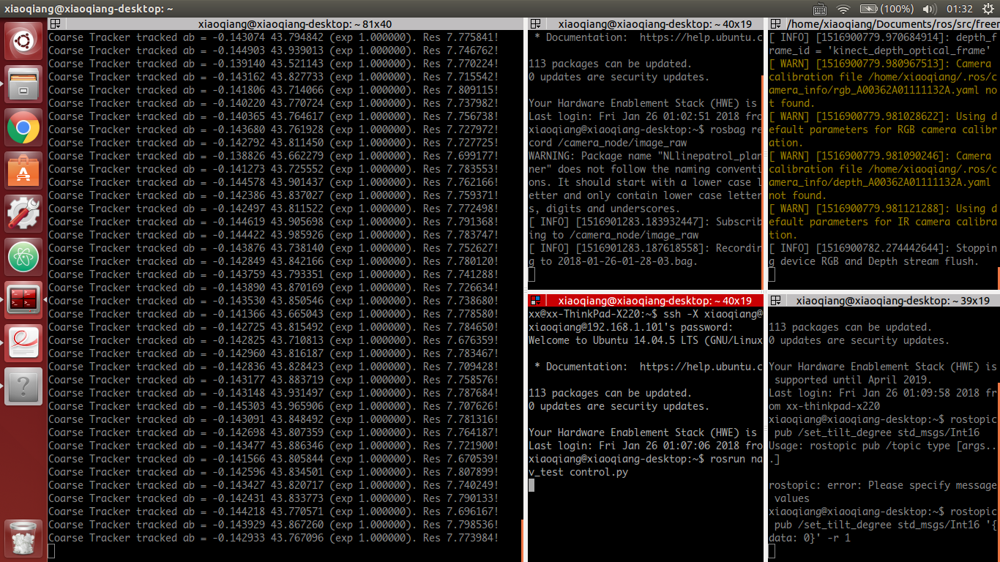
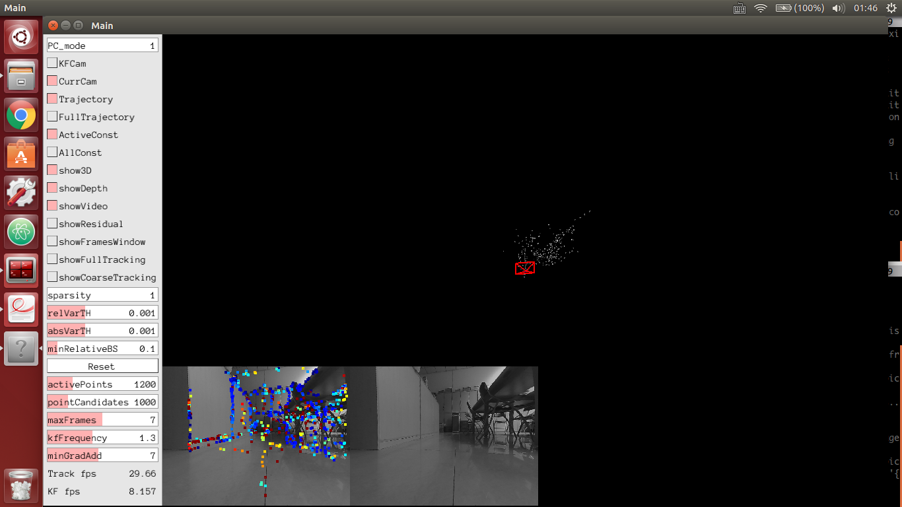

## 十四. NLlinepatrol_planner 的简单使用
随小车主机附带的 NLlinepatrol_planner 是一个用于视觉导航的全局路径规划器,根据小车输出的视觉轨迹(视觉轨迹文件的获得请参考当前栏目下的帖子),能输出一条连接小车当前坐标和目的坐标的全局路径,下文将通过一个模拟实例来演示它的使用方式。主要思路是:一个 python 脚本发布虚拟的视觉里程计和相关 tf 树,一个 python 脚本给 move_base 节点发布目标点,最后 move_base 节点通过调用 NLlinepatrol_planner 获得一条全局路径并在 rviz 中显示。
1. 配置 NLlinepatrol_planner
需要提供 NLlinepatrol_planner 待读取的 **视觉导航路径文件**、轨迹坐标变换需要的变换参数文件,这两文件都应该放在 NLlinepatrol_planner 下面的 data 文件夹内,文件名任意,通过配置 move_base 中的相关参数可以指定 NLlinepatrol_planner 读取的文件,下文会说明。

在上图中,NAV1.CSV 是视觉轨迹文件、TFSETTINGS.TXT 为变换参数文件(第一行是旋转矩阵
的 9 个元素、数组元素排列顺序为 C 语言的行排列,第二行为平移向量的 XYZ 分量,第三行
为 SCALE 因子)
2. 制作 move_base 的 launch 文件  
对于本教程,我们已经在 nav_test 软件包中的 launch 文件夹内提供了相关的 luanch 文
件,名字为 `xq_move_base_blank_map2.launch`,这个 luanch 文件在实际运用时可以作为模板,
需要注意的地方请看下图

这个 luanch 文件会调用 `xq_move_base2.launch` 文件,`xq_move_base2.launch` 文件也在当前
目录下,里面的内容如下
```
<launch>
<node pkg="move_base" type="move_base" respawn="false" name="move_base" output="screen">
<param name="base_global_planner" value="NLlinepatrol_planner/NLlinepatrolPlanner"/>
<rosparam file="$(find nav_test)/config/NLlinepatrol/costmap_common_params.yaml" command="load" ns="global_costmap" />
<rosparam file="$(find nav_test)/config/NLlinepatrol/costmap_common_params.yaml" command="load" ns="local_costmap" />
<rosparam file="$(find nav_test)/config/NLlinepatrol/local_costmap_params.yaml" command="load" />
<rosparam file="$(find nav_test)/config/NLlinepatrol/global_costmap_params.yaml" command="load" />
<rosparam file="$(find nav_test)/config/NLlinepatrol/base_local_planner_params.yaml" command="load" />
<rosparam file="$(find nav_test)/config/NLlinepatrol/base_global_planner_params.yaml" command="load" />
</node>
</launch>
```
通过上述内容,可以发现通过设置 `BASE_GLOBAL_PLANNER` 参数值来制定全局路径规划
器为 `NLLINEPATROL_PLANNER`,还可以看出 MOVE_BASE 的其它参数配置文件放在 NAV_TEST
软件包内的 `config/NLlinepatrol` 路径内

对于上图,我们需要更改的文件是 `BASE_GLOBAL_PLANNER_PARAMS.YAML`,因为这个文件
里的内容对应 `NLLINEPATROL_PLANNER` 运行时实际加载的参数,默认内容如下
```
NLlinepatrolPlanner:
DumpFileName: AnnDump.sav
strTFParsFile: TFSettings.txt
TxtFileName: nav1.csv
ANN_Dump_Bool: false
connect_distance: 0.3
```
`TXTFILENAME` 指定加载的视觉轨迹文件名,`STRTFPARSFILE` 指定加载的变换参数文件名,
`CONNECT_DISTANCE` 设置视觉轨迹文件中连通点之间的最大距离(坐标变换后两个点之间的
距离小于该值就认为这两点之间没有障碍物,可以直接连接), `ANN_DUMP_BOOL` 值为 `FALSE`
表示从 TXT 文件中加载轨迹和变换参数、如果为 `TRUE` 则从 `DUMPFILENAME` 参数指定的 `DUMP`
文件加载(多次使用同一个视觉轨迹文件时,第二次以后从 DUMP 文件启动可以加速)
3. 配置完成开始使用  
A. 因为我们这次是虚拟运行,发布的一些 topic 是没有实际意义的但是和小强默认 ROS 驱动
冲突,所以现在需要停止所有 ROS 运行实例
```
sudo service startup stop
roscore
```
B. 启动虚拟 topic 和小强模型文件
 ```
rosrun orb_init temp.py //发布 odom
roslaunch xiaoqiang_udrf xiaoqiang_udrf.launch //启动模型
```
C. 启动上文制作的 `xq_move_base_blank_map2.launch` 文件
```
roslaunch nav_test xq_move_base_blank_map2.launch
```
D. 启动 rviz,并打开 `ros/src/nav_test/config/nav_xq2.rviz` 配置文件
```
rviz
```
E. 启动虚拟 goal 发布节点(基于惯性导航中的 squre.py 修改而来)
```
rosrun nav_test NLlinepatrol.py
```
4. 现在 rviz 中就已经出现目标全局路径轨迹了(绿线),想测试其它 goal 目标
点,请自行修改 `NLlinepatrol.py` 中相关代码
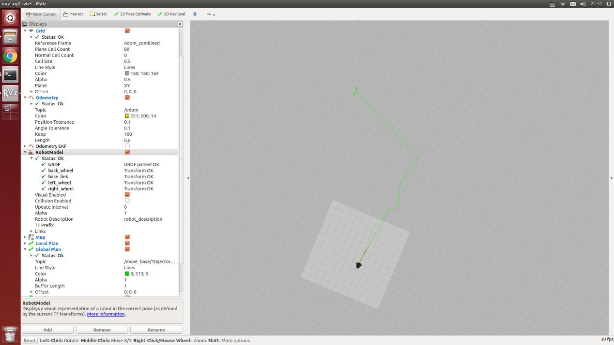
